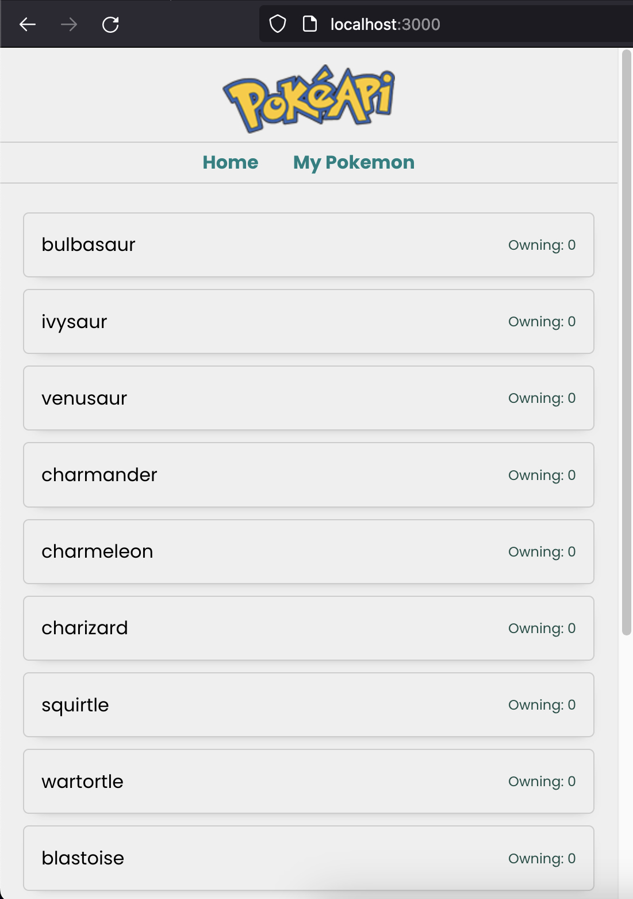

# React Pokemon

This website build using ReactJS, this site consist of 3 pages,
home, detail pokemon, and mypokemon.

- home will display pokemon list
- detail pokomon will display detail pokemon that user have clicked
- mypokemon is pokemon list that user catched


## Screenshots




## Run Locally

Clone the project

```bash
  git clone https://github.com/caesareza/reactjs-pokemon
```

Go to the project directory

```bash
  cd reactjs-pokemon
```

Install dependencies

```bash
  npm install
```

Start the server

```bash
  npm run start
```

